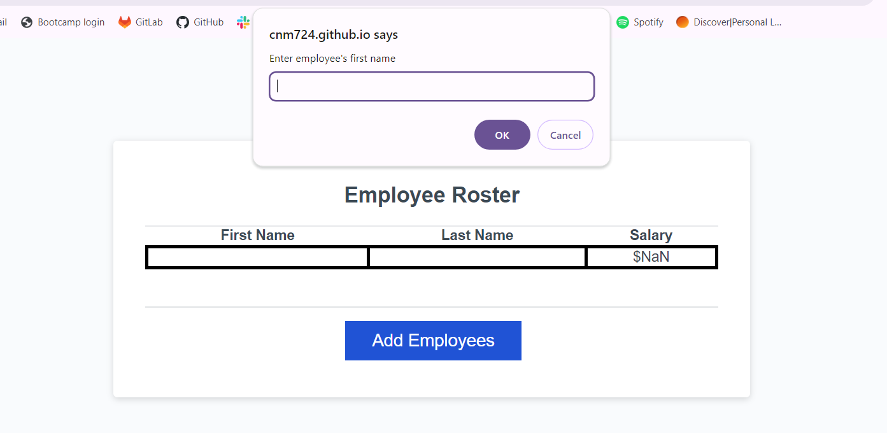
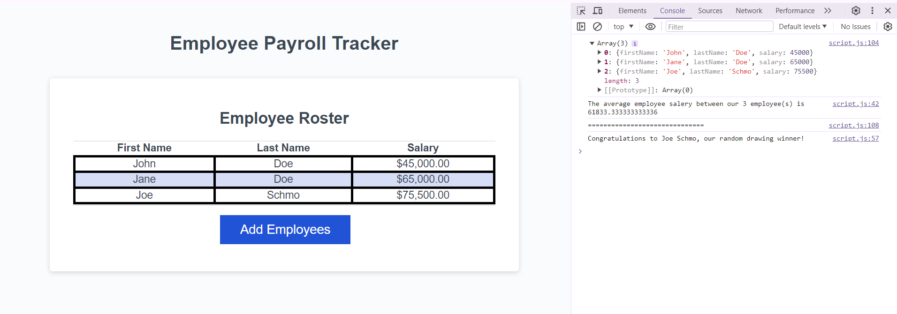

# Employee Payroll Tracker.Modified JavaScript

## Description
An application that allows the user to input an Employee's first name, last name, and salary. That information is then displayed on screen, and an array is created to store the data. With that data, the average salary of the inputed employees is printed within the console; as well as, randomly drawing a winner from the inputed employees and printing on the console.

[GitHub Repo Link](https://github.com/cnm724/employee_payroll_tracker_modifiedjs)

[Deployed URL](https://cnm724.github.io/employee_payroll_tracker_modifiedjs/)

## Usage
### Prompt popup when clicking Add Employees button

### End result when user inputs employee information

## Credits
[Malcom's github](https://github.com/MmalcolmM) - collaborated on project

Xpert Learning Assistant - ternary operator line 20 in script.js

## License
MIT License
